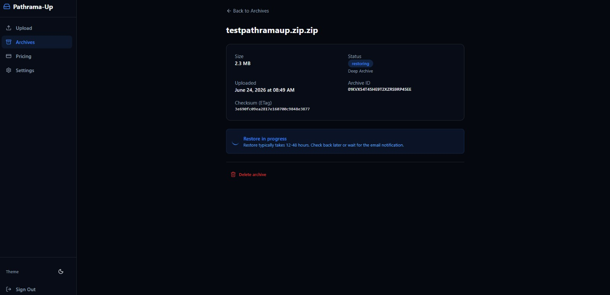

<div align="center">
  
  
  
  
  
  
  
  
</div>

<br />

<div align="center">
  
  <h1>Pathrama-Up</h1>
  <p><strong>Cloud backup platform with event-driven restore workflows</strong></p>
</div>

---

## Features

- **Upload & Forget** — Files upload and are stored securely. No manual maintenance required.
- **Event-Driven Restore** — S3 EventBridge triggers Lambda on restore completion — no polling, no idle cost.
- **Email Notifications** — Get notified when your restore is ready.
- **48-Hour Download Window** — Presigned URLs for secure, time-limited downloads.
- **Archive Management** — Delete, batch restore, search, filter, and sort your archives.
- **Dark/Light Mode** — Theme toggle with persistent preference.

## Architecture

```
Browser (Next.js 14)
    │
    ├─ Auth ──→ Cognito User Pool ──→ JWT Token
    │
    └─ API ──→ API Gateway ──→ 13 Lambda Functions (Go)
                                    │
                          ┌─────────┼─────────┐
                          │         │         │
                     DynamoDB      S3        SES
                          │         │
                          │    Deep Archive
                          │
                     EventBridge (event-driven)
```

## Tech Stack

### Frontend
| Technology | Purpose |
|---|---|
| Next.js 14 (App Router) | React framework |
| TypeScript | Type safety |
| Tailwind CSS 3.4 | Utility-first CSS |
| shadcn/ui | Component library |
| Framer Motion | Animations |
| aws-amplify v6 | Cognito authentication |
| lucide-react | Icons |

### Backend
| Technology | Purpose |
|---|---|
| Go 1.26 | Lambda runtime |
| AWS Lambda (provided.al2) | Serverless compute |
| API Gateway (HTTP API) | API layer |
| DynamoDB (PAY_PER_REQUEST) | NoSQL database |
| S3 + Glacier Deep Archive | File storage |
| SES | Email notifications |
| EventBridge | Event bus |
| Cognito | Authentication |
| Razorpay | Payment processing |

## Lambda Functions

| Function | Trigger | Purpose |
|---|---|---|
| `upload-request` | API Gateway POST /upload/request | Validate limits, generate presigned URL, create record |
| `upload-complete` | S3 ObjectCreated | Confirm upload, update status |
| `list-archives` | API Gateway GET /archives | Paginated archive list |
| `get-archive` | API Gateway GET /archives/{id} | Single archive details |
| `initiate-restore` | API Gateway POST /archives/{id}/restore | Call RestoreObject, create RestoreJob |
| `check-restore-status` | EventBridge (Object Restore Completed/Expired) | Update status, send email |
| `generate-download-url` | API Gateway GET /archives/{id}/download | Presigned download URL with expiry check |
| `get-user-profile` | API Gateway GET /user/profile | User plan + storage info |
| `create-razorpay-order` | API Gateway POST /payments/create-order | Create Razorpay payment order |
| `verify-razorpay-payment` | API Gateway POST /payments/verify | Verify signature, update plan |
| `delete-archive` | API Gateway DELETE /archives/{id} | Delete S3 object + DynamoDB record |
| `batch-restore` | API Gateway POST /archives/restore/batch | Bulk restore multiple archives |
| `cancel-subscription` | API Gateway POST /payments/cancel | Downgrade to free plan |

## Local Development

### Prerequisites
- Node.js 18+
- Go 1.26+
- AWS CLI (authenticated)

### Frontend
```bash
cd frontend
npm install
cp .env.example .env.local
npm run dev
```

### Backend
```bash
cd backend
$env:GOOS="linux"; $env:GOARCH="amd64"; $env:CGO_ENABLED="0"
go build -o build/<name>/bootstrap ./cmd/<name>
```

## License

MIT
